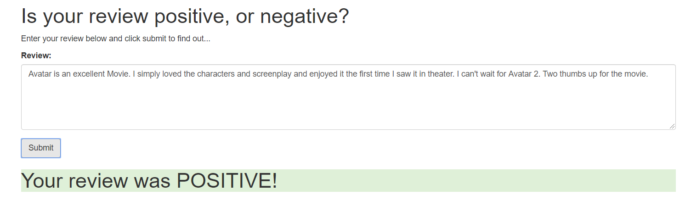
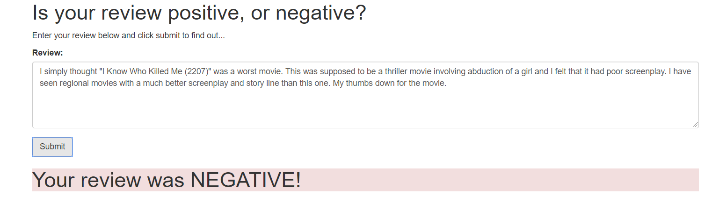

## Welcome to Sentiment-Analysis using SageMaker

In this project we will train a RNN-LSTM model on a dictionary of words created using movie reviews provided in the IMDb dataset available here http://ai.stanford.edu/~amaas/data/sentiment/. The final goal is to train a model that performs well on the IMDb dataset and then save it in AWS S3 and then invoke it via an endpoint using a simple webapp that can be viewed in a web browser.
	
### Table of Contents

1. [Installation](#installation)
2. [Motivation](#motivation)
3. [Web App Architecture](#Architecture)
4. [Jupyter Notebook File (*.ipynb) Descriptions](#files)
5. [Summary Results](#summaryresults)
6. [Screenshots of Web App deployment](#screenshots)
7. [Licensing, Authors, and Acknowledgements](#licensing)
	
## Installation 

The python notebook file in this repo should run with Anaconda distribution of Python versions 3.6.

To explore this project you can clone this repo via AWS SageMaker notebook instance and then work with SageMaker Project.ipynb.

The notebook has great documentation providing a step by step walkthrough on training, testing and deploying the sentiment analysis model and finally accessing the model endpoint using a web app. The project itself was completed as part of Udacity's Machine Learning Nanodegree program.

## Motivation

AWS provides quiet a number of cloud services for Data Scientists and Machine Learning Engineers to explore and learn concepts of Artificial Intelligence, Machine and Deep Learning. SageMaker provides easy to use options that helps create, validate and deploy Machine Learning models. In this project we will explore how to train, validate and deploy a Pytorch RNN-LSTM model and finally talk to it via Rest API endpoint that was created using AWS API gateway. I think cloud technologies that AWS provide simply eases the way engineers can automatically train, test and deploy machine learning models into production enviroments. Cloud services also provide benefits of swapping out an out dated model without much down-time so that end users get seemless upgrade to the latest and greates ML models under the hood.

## Web App Architecture

A diagram showing the blocks that will be involved in this web app is below,
	

	
## Files

The main files in this repo that are required for running of the web app are briefly summarized below,

1. **SageMaker Project.ipynb**
     - This notebook file provides a step by step walkthrough to train, test and deploy the RNN-LSTM model to predict user sentiments (i.e. positive or negative) for a given movie review. The notebook is complete and well documented as to how to naviagate from one cell to another. Thanks to Udacity for providing this notebook and clear documentation. As part of the project completion I only had to work on the TODO items in this notebook.
				
2. **train.py**
     - This python script completes the training portion of the analysis. It contains the train function which was completed as part of the assignment.

3. **predict.py**
     - This python script completes the custom inference code that will serve as an entry point for the Pytorch model to predict new text entered by the user on the web app. In short the script contains the predict_fn() function that was completed as part of the assignment and is required for scoring new text.

## Summary Results

To summarize we were able to successfully complete the SageMaker Project.ipynb and answer all the questions that were asked as part of the assignment. We found that the models accuracy was roughly around 0.85 (85%) when we validated it on the test set from IMDb data. Also, we successfully created a Lambda function endpoint in AWS and exposed it via API Gateway so that our Web app can send revies and instantly get the sentiment (positive or negative) for the review on the browser itself.

All analysis and results are well documented with the attached SageMaker Project.ipynb. Please review that for more details.

## Example Screenshots

	

## Licensing, Authors, Acknowledgements

You can find the Licensing and other descriptive information about this project [here](https://github.com/kart-projects/Sentiment-Analysis/blob/master/LICENSE). Also I should mention a special thanks to Udacity for having provided such a detailed notebook and documentation for this project. I only completed the sections in the notebook and scripts as part of assignment submission for Machine Learning Engineer Nanodegree Certification.